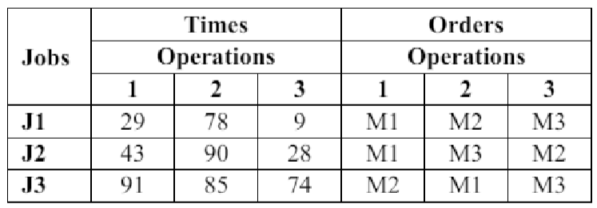
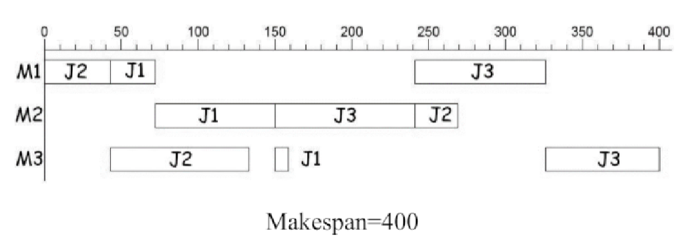
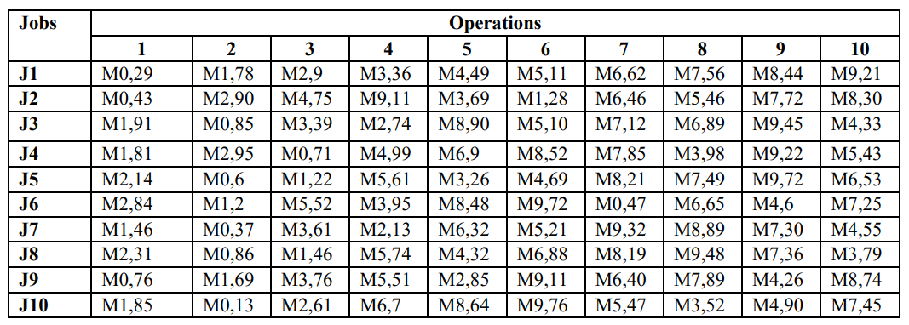
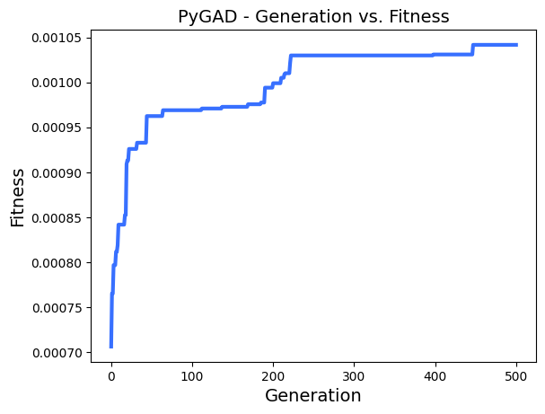
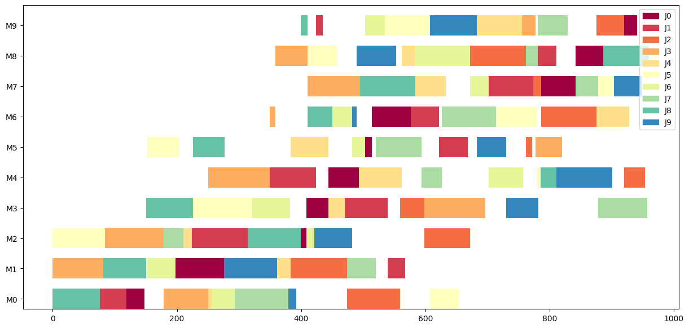

# Solving the Job-Shop Scheduling Problem using Genetic Algorithm
From Wikipedia, the free encyclopedia
> Job-shop scheduling, the job-shop problem (JSP) or job-shop scheduling problem (JSSP) is an optimization problem in computer science and operations research. It is a variant of optimal job scheduling. In a general job scheduling problem, we are given n jobs $J_1, J_2, ..., J_n$ of varying processing times, which need to be scheduled on m machines with varying processing power, while trying to minimize the makespan – the total length of the schedule (that is, when all the jobs have finished processing). In the specific variant known as job-shop scheduling, each job consists of a set of operations $O_1, O_2, ..., O_n$ which need to be processed in a specific order (known as precedence constraints). Each operation has a specific machine that it needs to be processed on and only one operation in a job can be processed at a given time. A common relaxation is the flexible job shop, where each operation can be processed on any machine of a given set (the machines in each set are identical).

## Problem Statement
Suppose there are a number of jobs that must be completed by machines ($M_1, M_2, ..., M_m$). Each job includes a number of operations that must be performed in order for the job to be completed. The processing time of each operation is predetermined and does not depend on being executed on different machines. For example, when the required time to perform an operation is 1 second, this time will also be 1 second on any of the Ms. Each machine can only perform one operation at a time. The objective of JSSP is to minimize the total completion time of all jobs (Makespan). The JSSP problem is classified as NP-hard. Many evolutionary methods have been used to solve this problem so far. The genetic algorithm has also been used as one of the popular evolutionary methods in various studies, and they differ in the way they represent and define crossover and mutation operators.

### Example
Consider the dummy data provided in the table below containing 3 jobs and 3 machines:

Below is a Gantt chart for one of the possible answers:

## Objective
The goal here is to try and solve the Job-shop Scheduling optimization problem using Genetic Algorithm and benchmark it on a given instance of the problem (set of jobs and their corresponding operation orders).
## Benchmark Data
To benchmark the GA, an instance of JSSP consisting of 10 jobs and 10 machines is used:

The **optimal makespan** of this problem instance is 935 time units.
## Method
In order to solve JSSP using Genetic Algorithm, we must first propose or choose proper candidates for the following components:
- Solution representation
- Crossover operator
- Mutation operator

### Solution Representation (Encoding)
The encoding method used, called operation-based representation, is a coding scheme consisting of integers in the range $[0, n)$ ($n$ denotes the number of jobs here). Each integer in this range is repeated exactly as many times as there are operations. Suppose $c_{ij}$ denotes the position of the $j$-th occurrence of the number $i$ in a chromosome; in this case, the $c_{ij}$-th scheduled operation that this chromosome represents is the $j$-th operation of job $i$.  
For example, if we have two jobs with two operations each, for the chromosome:
$$ch=\{0, 1, 1, 0\}$$
It corresponds to the following schedule:
1. Execute operation 0 of job 0
2. Execute operation 0 of job 1
3. Execute operation 1 of job 1
4. Execute operation 1 of job 0

It is evident that the length of all chromosomes is equal to $n*m$, where $n$ denotes the number of jobs and $m$ denotes the number of operations. For a chromosome to be legal, each number in the range $[0, n)$ must be repeated exactly $m$ times. Consequently, using a standard single-point crossover operation will easily produce illegal and invalid chromosomes. To solve this issue, a **new operator is introduced**, which will be discussed in the next section.

### Crossover Operator
In a [paper](https://ieeexplore.ieee.org/document/400072) that adapts the operation-based representation for solving JSSP, an innovative crossover method is also presented briefly and with limited details. This method is very similar to the standard crossover and includes a repair operation to restore the chromosome after crossover. The operator was implemented and tested, but the results were not promising.

A new crossover operator is proposed and implemented in this notebook, that was mainly inspired by a paragraph in this [paper](https://www.sciencedirect.com/science/article/abs/pii/0360835296000472). Generally, this operator involves splitting the chromosome into two independent schedules and then merging these schedules. In a standard crossover method, offspring are created by splitting the entire chromosome into two parts based on a random cut point. Instead, let's remove all jobs with numbers greater than or equal to $k$ from one chromosome and all jobs with numbers less than $k$ from the other chromosome. Both resulting chromosomes will still have valid repetitions of each job, equal to the number of operations ($m$). If we then combine the two chromosomes based on the position of each job in the original parent chromosomes, we obtain a valid offspring without needing any repair or recovery. ($0 < k < n$).
#### Example
$$x_1=[2,2,1,3,0,3,1,3,0,1,1,0,0,3,2,2]$$
$$x_2=[1,1,3,0,1,3,0,2,1,2,2,3,0,3,0,2]$$
By applying the crossover operator with $k=2$, the following 2 offspring will be produced:
$$o_1=[1,3,0,3,1,2,0,1,2,1,2,0,3,0,3,2]$$
$$o_2=[2,1,2,1,3,0,1,3,0,3,1,0,3,2,0,2]$$
In which the procedure for producing $o_1$ is:
- remove jobs $\geq 2$ from $p_1$: $[-,-,1,-,0,-,1,-,0,1,1,0,0,-,-,-]$
- remove jobs $< 2$ from $p_2$: $[-,-,3,-,-,3,-,2,-,2,2,3,-,3,-,2]$
- merge: $[1,3,0,3,1,2,0,1,2,1,2,0,3,0,3,2]$

For $o_2$, we follow the same steps, but this time we remove jobs less than $k$ from the first parent and jobs greater than or equal to $k$ from the second parent. (Similar to crossover, where two opposite segments create two offspring)
### Mutation Operator
The mutation process is very simple. A pair of unequal numbers is randomly selected from the chromosome and swapped. This creates a slight change in the schedule, and the resulting chromosome will always be valid.
### Fitness
To calculate the fitness value, the chromosome must be decoded into a schedule, and the makespan or total elapsed time is calculated. Then, the inverse of the makespan is taken as the fitness value because the total elapsed time of the schedule needs to be minimized.
$$f(x)=\frac {1}{M(D(x))}$$
Where:
- $D(x)$ is the decoder function that gives the corresponsing schedule to individual $x$
- $M(s)$ is the makespan function that calculates the makespan of a given schedule by partially simulating the execution of jobs.
### Genetic Algorithm
The operators and the fitness function are used along with the **pygad** library that provides ready-to-use GA.  
Each generation consists of 200 individuals, with 100 parents considered for each generation. The parents of each generation, along with 100 offspring produced from them, form the next generation. Parent selection follows rank selection.

## Results
The benchmark instance discussed earlier was used to test the implemented method.
> To ensure reproducibility, a random initial population is created and saved in a text file (initial.txt). Use the file along with the pre-set random_seed in the notebook.

The results obtained from running the genetic algorithm for 500 generations:  
**Makespan of global best solution: $960$**

  
*Generation vs. Fitness*

  
*Gantt chart of the best solution*