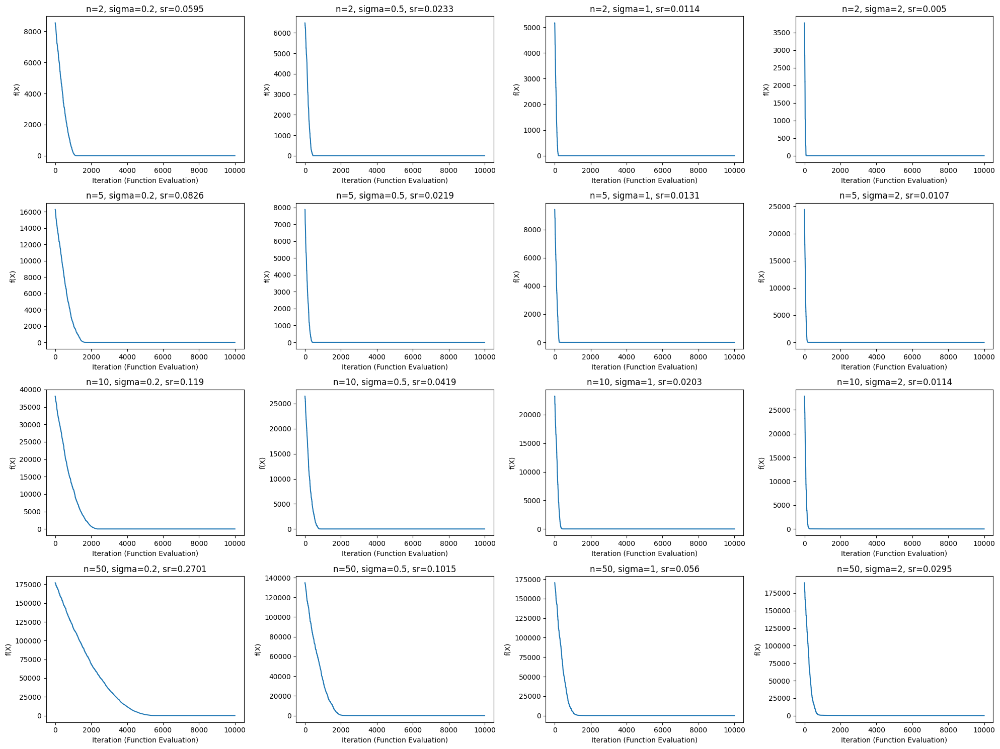
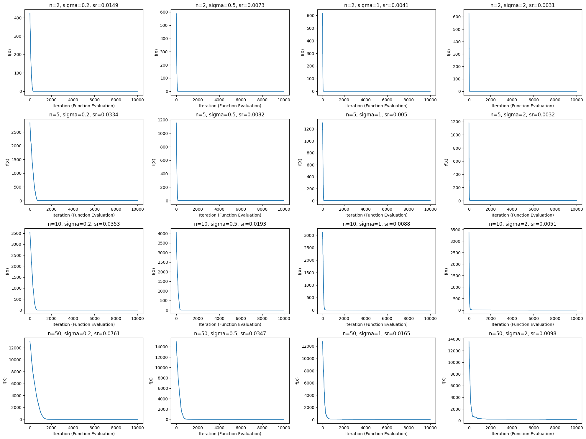

# Canonical Evolution Strategies (ES)
The 'evolution strategy' optimization technique was created in the early 1960s and developed further in the 1970s and later by Ingo Rechenberg, Hans-Paul Schwefel and their co-workers.  
From the Wikipedia page of [Ingo Rechenberg](https://en.wikipedia.org/wiki/Ingo_Rechenberg):
>Ingo Rechenberg (20 November 1934 – 25 September 2021) was a German researcher and professor in the field of bionics. Rechenberg was a pioneer of the fields of evolutionary computation and artificial evolution. In the 1960s and 1970s he invented a highly influential set of optimization methods known as evolution strategies (from German Evolutionsstrategie). His group successfully applied the new algorithms to challenging problems such as aerodynamic wing design. These were the first serious technical applications of artificial evolution, an important subset of the still growing field of bionics.

In this exercise, we will implement and test a basic evolutionary strategies (ES) algorithm. The basic or canonical ES algorithm has a single-member population, producing one offspring per generation. This algorithm is generally represented in the ES form as $(1,1)−𝐸𝑆$.
## Formulation
An instance of ES, will optimize an objective function $f(x)$ with respect to $x \in R^n$, over a given domain $D_x$ ($x_i \in D_x$), using an arbitrary mutation rate $\sigma$.

Mathematically, ES can be summarized in the following equation:
$$X_{t+1}=
\begin{cases}
    X_t + \sigma Z_t & \text {if } f(X_t + \sigma Z_t) \leq f(X_t)\\
    X_t & \text {otherwise}
\end{cases}$$

$$Z \sim N(0, 1)$$
$$Z \in R^n$$
$$\sigma > 0$$
> ${if } f(X_t + \sigma Z_t) \leq f(X_t)$ denotes **minimization**
## Implementation
The algorithm is implemented as a class named ES. This class consists of three methods: gen_next, run, and history_plot, which are responsible for calculating the next generation, running the algorithm for a specified duration, and plotting the history of the algorithm's execution, respectively.

To optimize a desired objective function using the implemented class, you first need to implement the function as a standard Python function. Then, pass this function to the constructor when creating an instance of the class.
### Example usage

    def f1(x):
        return np.sum(x**2)
    
    # 2 is the number of dimensions in x
    # f1 is the objective function
    # 0.05 is the mutation factor sigma
    # (-100, 100) is the domain of x
    es = ES(2, f1, 0.05, (-100, 100))
    es.run()

## Benchmark
The following benchmark functions are used to test the implemented algorithm:
$$F_1(X) = \sum_{i=1}^n x_i^2$$
$$F_5(X) = \sum_{i=1}^{n-1} [100(x_{i+1} - x_i^2)^2 + (x_i - 1)^2]$$
For each of the two functions, all possible combinations of the following parameter values are tested:
$$n \in \{2, 5, 10, 50\}$$
$$\sigma \in \{0.2, 0.5, 1, 2\}$$
### $F_1(X)$

In the 4x4 table consisting of 16 charts shown in the image, the rows represent different values of $n$ and the columns represent different values of $\sigma$. Additionally, $sr$ denotes the success rate. It is clearly observed that increasing the value of $n$ leads to an increase in the success rate, while increasing 
$\sigma$ leads to a decrease in the success rate. The mathematical reason for the correlation between the success rate and $n$ is not clear to me.  
In the leftmost column of the image, the average number of function evaluations until reaching near-optimal solutions is significantly higher than in the other columns. Achieving near-optimal solutions in fewer iterations with increasing $\sigma$ is clearly evident in the charts in image, which is a result of larger steps in the space caused by larger $\sigma$ value.
### $F_5(X)$
