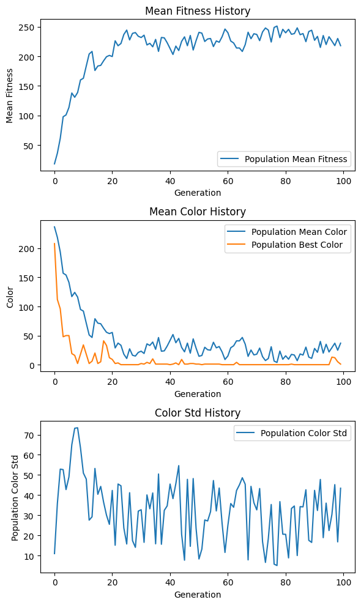
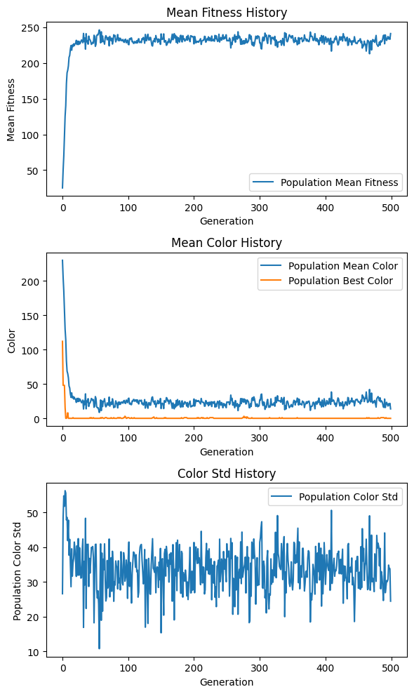
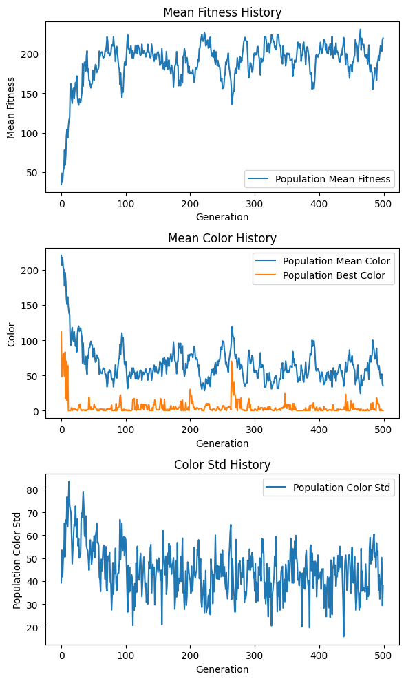
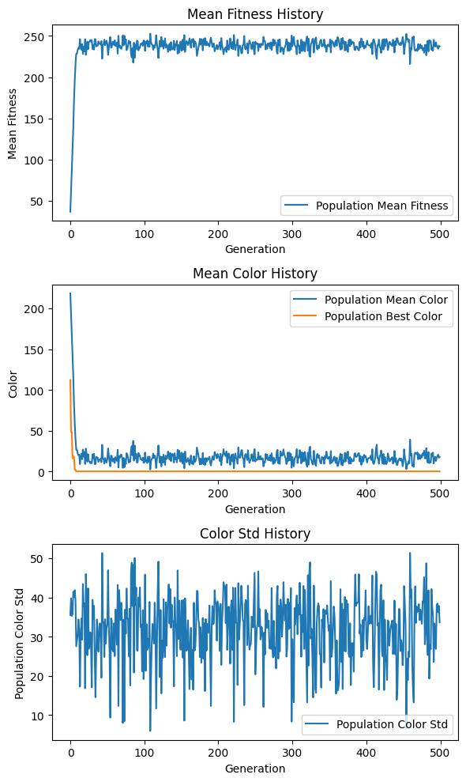

# DarBaby Evolution - A Simple HelloWorld to Evoluationary Computation

> This notebook is an implementation based on [this](https://www.youtube.com/watch?v=JkAKtrZo4j0) video created by [cassiopeiaproject](https://www.youtube.com/@cassiopeiaproject)

## Introduction
DarBabies, short for **Darwin Babies**, are simple creatures with a single trait: color, which allows them to blend into their environment. Each DarBaby has an 8-bit genome that determines its color in the grayscale spectrum. The environment they live in is a screen with a fixed color. There is a predator in the environment that, each generation, eats some of the DarBabies that are easily visible and some others randomly. DarBabies can reproduce in pairs to create offspring. During reproduction, they pass on some of the traits stored in their genome to their offspring. Additionally, mutations can occur, causing changes in the offspring's genome.

The goal here, is to simulate the evolution of DarBabies, by implementing the following:
- DarBabies
  - Reproduction mechanism
- Environment
- Predator

In the world of DarBabies, a DarBaby is more likely to be hunted by the predator, if its color trait makes it more visible to the predator. Hence, the probability of DarBaby $i$ being hunted is proportional to how much its color is similar to the environment's color.

$p_{prey_i}$: Probability of DarBaby $i$ to be hunted  
$C_{env}$: Environment color  
$C_{i}$: Color of DarBaby $i$
$$p_{prey_i} \propto |C_{env}-C_{i}|$$

It is expected that by simulating the DarBaby environment, natural selection will cause the DarBabies to evolve over time and blend into the environment.

## Implementation
In the implemented code, the concept of a DarBaby is encapsulated in a class named DarBaby. Each instance of this class represents a DarBaby with its unique genome. An additional class named DarBabiesEvo has been implemented to handle the evolution algorithm.

Key points about the implemented code:

- Each 8-bit binary genome corresponds to a decimal number in the range [0, 255], representing a color in the grayscale spectrum; 255 indicates white, and 0 indicates black.
- The background color of the environment is also represented by a decimal number within the aforementioned range.
- The reproduction process is entirely random, with each pair of DarBabies having an equal chance of producing offspring.
- During offspring creation, both parents equally contribute to the genome: the first half of the offspring's genome comes from the first parent, and the second half comes from the second parent.
- Each offspring has a 50% chance of experiencing a mutation, which affects just one bit of its genome.
### Fitness
As mentioned before, the fitness of a DarBaby in the environment can be formulated based on its probability of survival:
$$f(DarBaby_i)=255-|C_{env}-C_{i}|$$
> Note that the fitness function is not explicitly implemented and used in the simulation, we rather use it implicitly in the predator's hunt tactic. We measure and track the average fitness value of the population to show the emergence of evolution.

## Expreminets and Results
We run the simulation with different parameters and analyze the results.  
The parameters under investigation are:
- **n_babies**: The number of DarBabies in each generation
- **hunt_kill**: The percentage of the population hunted by the predator
- **rand_kill**: The percentage of the population randomly hunted by the predator
- **background_color**: The background color of the environment
- **initial_genome**: The initial genome of the first generation of DarBabies
- **n_generations**: The number of generations simulated

In all the simulations analyzed, background_color is set to $0$, and initial_genome is set to $11110000$.
### Experiment 1
    n_babies=16
    hunt_kill=0.25
    rand_kill=0.25
    n_generations=100
    Best DarBaby=DarBaby[genome=00000000][color=0]

Within the first 20 generations, DarBabies that perfectly match the background color emerge. The average color of the population gradually approaches the background color and fluctuates. This fluctuation in the average color is likely due to the high mutation rate and the presence of random deaths.
### Experiment 2
    n_babies=64
    hunt_kill=0.25
    rand_kill=0.25
    n_generations=500
    Best DarBaby=DarBaby[genome=00000000][color=0]

The result is similar to the previous simulation. Very soon, DarBabies that match the background color appear, and a form of convergence occurs. This means that the average color of the population gets close to the background color but never quite reaches it. The fluctuation in the average color of the population continues until the end of the simulation because the factors causing the fluctuation, as mentioned earlier, persist throughout the simulation.
### Experiment 3
    n_babies=32
    hunt_kill=0.1
    rand_kill=0.4
    n_generations=500
    Best DarBaby=DarBaby[genome=00000000][color=0]

Increasing the percentage of the population that randomly perishes causes an increase in the amplitude and period of the fluctuations in the average color of the population. It is also evident that, at times, due to the random elimination of DarBabies that match the environment (along with other factors such as mutation), there are no DarBabies matching the background color in the next generation. In such cases, even the best DarBaby of that generation has a color significantly different from the background.
### Experiment 4
    n_babies=32
    hunt_kill=0.5
    rand_kill=0.0
    n_generations=500
    Best DarBaby=DarBaby[genome=00000000][color=0]

Here, we have completely disabled the random deaths of DarBabies. Now, in each generation, precisely half of the population that is better adapted survives and reproduces. This significantly reduces the fluctuations in the color of the DarBabies. The only factor causing fluctuations here is mutation. Additionally, without random deaths, DarBabies that match the background color emerge much faster compared to previous simulations.